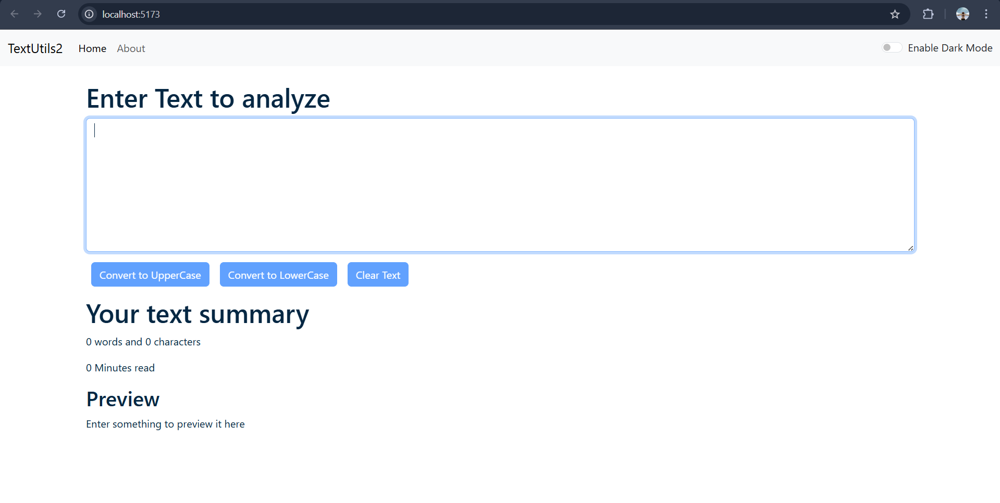

# TextUtils

TextUtils is a simple React web application that allows users to manipulate and analyze text efficiently.
It provides features like converting text case, counting words and characters, and estimating reading time.

---

## Features

* Convert text to **Uppercase**
* Convert text to **Lowercase**
* **Word and character counter**
* **Estimated reading time**
* **Clear text functionality**
* **Dark mode / Light mode support**
* Responsive UI

---

## Tech Stack

Frontend:

* React
* Vite
* JavaScript
* Bootstrap

---

## Project Structure

```
textutils
├── public
├── src
│   ├── components
│   │   ├── About.jsx
│   │   ├── Alert.jsx
│   │   ├── Navbar.jsx
│   │   └── TextForm.jsx
│   ├── App.jsx
│   └── main.jsx
├── screenshots
│   └── text-utils-dashboard.png
├── index.html
├── package.json
└── README.md
```

---

## Screenshots

### Dashboard



---

## Installation & Run Locally

Clone
